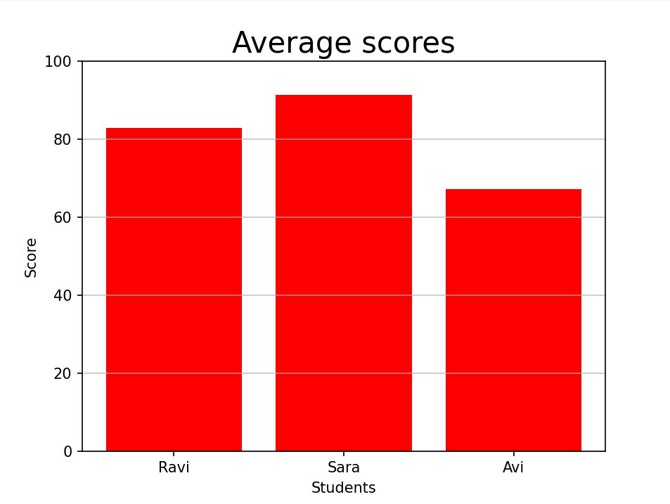

# Day 3: Student Average Score Plot

## Task
Given a dictionary of students and their scores in 3 tests, calculate their average and visualize it in a bar chart using `matplotlib`.

---

## Python Code

```python
import numpy as np
import matplotlib.pyplot as plt

# Dictionary of students and their scores in 3 tests
data = {
    'Ravi': [78, 82, 89],
    'Sara': [91, 94, 89],
    'Avi': [65, 67, 70]
}

# Calculate average score of each student
names = []
average = []
for name, score in data.items():
    names.append(name)
    avg_score = np.mean(score)
    average.append(int(avg_score))
print(average)

# Plotting the average scores using matplotlib
plt.bar(names, average, color='r')
plt.title('Average scores', fontsize=20)
plt.xlabel('Students')
plt.ylabel('Score')
plt.ylim(0, 100)
plt.grid(axis='y', alpha=0.7)
plt.show()
```
## Output


---

## Explanation of Code
For every element in the dictionary:
 - The key (name) is stored in a list for plotting.
 - The value (test scores) is passed to numpy.mean() to calculate the average.
 - Both lists are used to create a bar chart with matplotlib.
 - X-axis shows names, Y-axis shows scores, and bars represent the average value.

---

## What I Learned
- Use numpy to calculate values from a dictionary
- Create simple bar plots using matplotlib
- How to commit code from local system to GitHub using git